# Seminaarityö: LeetCode with Python

## Johdanto

Tämän seminaarityön ideana on kehittää omaa algoritmista ajattelua ja samalla syventää Python-osaamista käytännön kautta. LeetCode tarjoaa monipuolisia ohjelmointitehtäviä eri aihealueista ja vaikeustasoista ja se on suosittu alusta työnhakuun valmistautuessa tai oman osaamisen testaamisessa.

Tehtävien valinnassa käytin apuna tekoälyä, jonka avulla sain koottua mahdollisimman monipuolisen ja tasapainoisen tehtäväkokonaisuuden. Halusin mukaan erilaisia haasteita, joissa pääsee harjoittelemaan esimerkiksi taulukoita ja merkkijonoja, hakualgoritmeja, tietorakenteita ja dynaamista ohjelmointia. Näin sain rakennettua kokonaisuuden, joka kehittää teknistä osaamista, mutta myös ongelmanratkaisukykyä sekä loogista ajattelua.

Kaikki tehtävät on toteutettu Pythonilla ja pyrin kirjoittamaan ratkaisuni mahdollisimman selkeästi sekä tehokkaasti oman osaamiseni mukaan. Tehtävät on jaettu kolmeen vaikeustasoon: helppoihin, keskivaikeisiin ja vaikeisiin. Jokaiseen tehtävään on lisätty pohdinta tehtävästä: mitä opin sekä mitä haasteita tuli vastaan. Tehtävän yhteydestä löytyy myös kuva alkuperäisestä tehtävänannosta, jotta kokonaisuus olisi mahdollisimman ymmärrettävä.

## Tehtävät

### Helppo (15 kpl)

1. **Two Sum** ([LeetCode](https://leetcode.com/problems/two-sum/), [Ratkaisu](./1_easy/two_sum.py))
   
   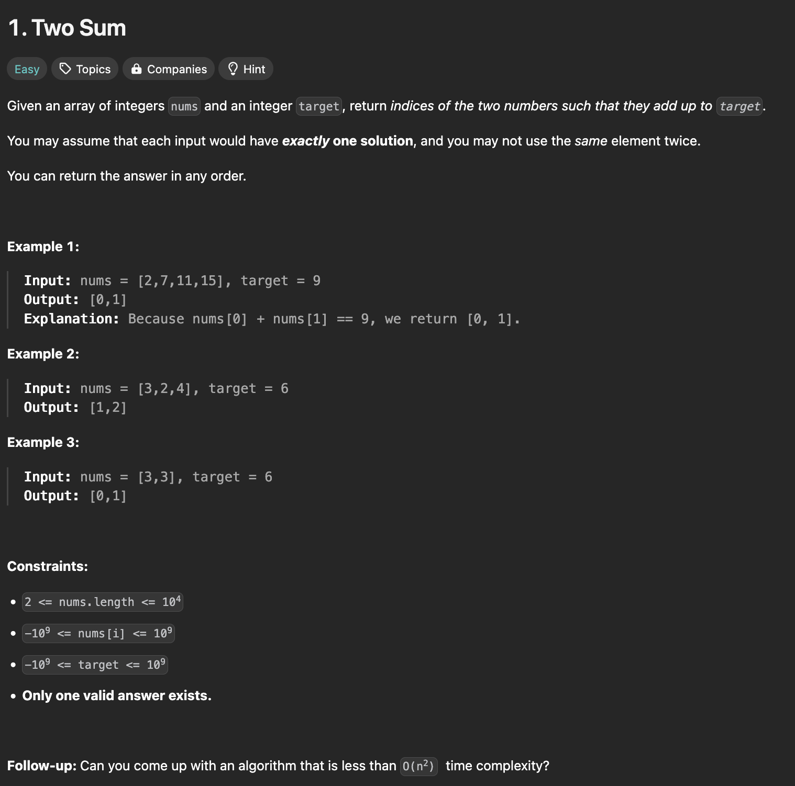

   **Miten tein tehtävän:**
      
   Tein tehtävän brute force -taktiikalla eli kahdella sisäkkäisellä silmukalla. Nämä käyvät läpi kaikki mahdolliset luvut ja etsivät parin, jonka summa on yhtä kuin annettu `target`. Kirjoitin ratkaisun Pythonilla.

   **Miten meni:**

   Ensimmäisellä yrityksellä sain `IndentationError` -virheen. Toisella yrityksellä sain koodin suorittamaan ilman virheitä, mutta se palautti tyhjän listan. Kolmannella yrityksellä vaihdoin hieman lähestymistapaa, mutta sisennys meni taas pieleen. Lopulta sain kuitenkin toimivan ratkaisun. Jo ensimmäisestä tehtävästä tuli olo, että miten voi olla näin vaikeaa, vaikka tämän pitäisi olla tasoltaan helppo. Asiaa auttoi muiden kommenttien lukeminen. Tästä Tajusin, että on tosi yleistä aloittaessa kokea samaa turhautumista ja osaamattomuuden tunnetta. 

   **Mitä opin:**

   - Pythonin sisennys on erittäin tarkkaa – pienikin virhe voi estää koodin ajon kokonaan.

   - On tärkeää lukea virheilmoitukset tarkasti ja etsiä niistä vihjeitä.

   - Vaikka brute force -ratkaisu toimii, ymmärsin, että tehtävän voi ratkaista myös tehokkaammin esimerkiksi HashMapin avulla.

   **Mitä voisin tehdä toisin seuraavalla kerralla:**

   - Suunnitella ratkaisun paremmin ennen koodin kirjoittamista.

   - Käyttää hyväksi materiaaleja sekä dokumentaatioita

   - Idean ymmärrettäessä kokeeilla .

   ---

2. **Palindrome Number** ([LeetCode](https://leetcode.com/problems/palindrome-number/), [Ratkaisu](./easy/palindrome_number.py))
   
   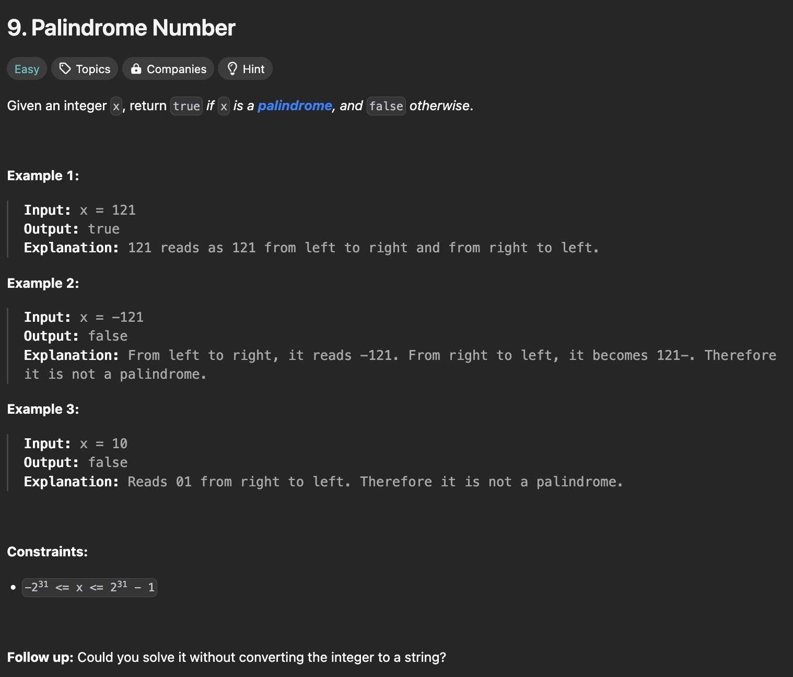

   **Miten tein tehtävän:**

   Tehtävänä oli tarkistaa, onko annettu kokonaisluku palindromi eli sama etu- ja takaperin luettuna. Muunsin kokonaisluvun merkkijonoksi ja vertasin sitä käännettyyn versioon `x[::-1]`. Jos ne ovat samat, luku on palindromi.

   **Miten meni:**

   Tehtävä oli melko suoraviivainen ja sain sen toimimaan nopeammin kuin `Two Sum` -tehtävän. Jouduin vähän tutkimaan netiste miten Pythonin merkkijonoja voidaan kääntää ja ratkaisu `[::-1]` oli helppo ja tehokas tapa ratkaista tehtävä. 

   **Mitä opin:**

   - Palindromin tarkistaminen onnistuu näppärästi kääntämällä merkkijono `[::-1]` -operaattorilla.

   - Koodia voi usein tiivistää ja tehdä selkeämmäksi poistamalla tarpeettomat ehtorakenteet. Toisaalta joskus tiivein koodi ei ole selkeintä vaikka se olisikin tehokkainta.  

   **Mitä voisin tehdä toisin seuraavalla kerralla:**

   - Tiivistää koodia heti alussa mahdollisimman yksinkertaiseksi, ratkaisussani if-rakenne oli turha ja olisin voinut toteuttaa tehtävän esimerkiksi näin:

   ``` python
   def isPalindrome(self, x: int) -> bool:
    return str(x) == str(x)[::-1]
   ```
   ---

3. **Merge Two Sorted Lists** ([LeetCode](https://leetcode.com/problems/merge-two-sorted-lists/), [Ratkaisu](./easy/merge_two_sorted_lists.py))
   
   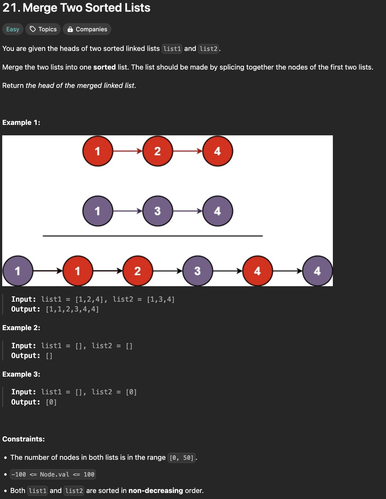

**Miten tein tehtävän:**

**Miten meni:**

**Mitä opin:**

**Mitä voisin tehdä toisin seuraavalla kerralla:**

   ---

4. **Valid Parentheses** ([LeetCode](https://leetcode.com/problems/valid-parentheses/), [Ratkaisu](./easy/valid_parentheses.py))
   
   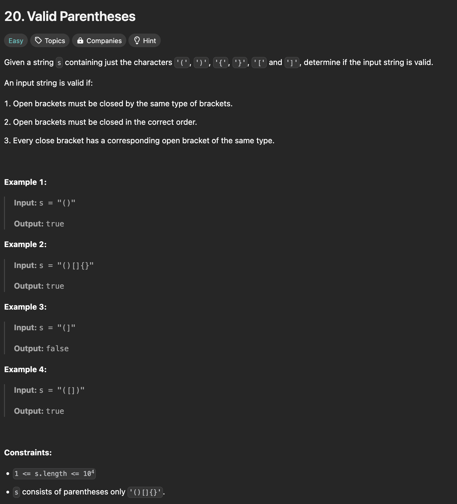

**Miten tein tehtävän:**

**Miten meni:**

**Mitä opin:**

**Mitä voisin tehdä toisin seuraavalla kerralla:**

   ---

5. **Best Time to Buy and Sell Stock** ([LeetCode](https://leetcode.com/problems/best-time-to-buy-and-sell-stock/), [Ratkaisu](./easy/best_time_to_buy_and_sell_stock.py))
   
   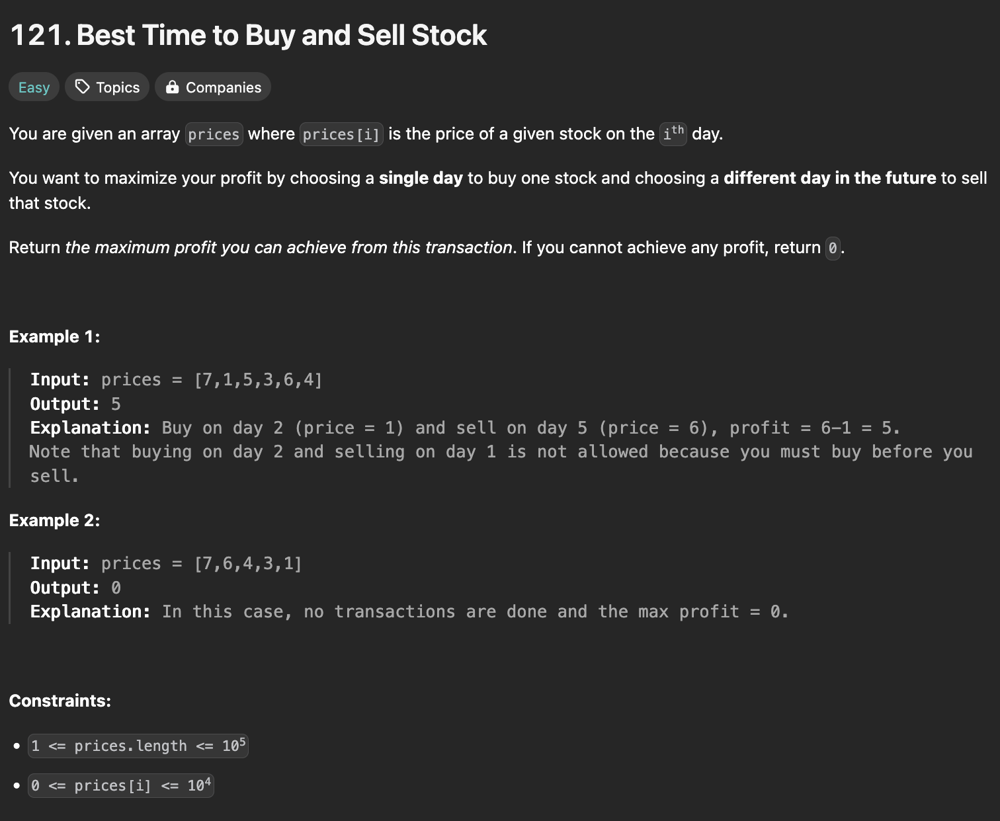

**Miten tein tehtävän:**

**Miten meni:**

**Mitä opin:**

**Mitä voisin tehdä toisin seuraavalla kerralla:**

   ---

6. **Maximum Subarray** ([LeetCode](https://leetcode.com/problems/maximum-subarray/), [Ratkaisu](./easy/maximum_subarray.py))
   
   

**Miten tein tehtävän:**

**Miten meni:**

**Mitä opin:**

**Mitä voisin tehdä toisin seuraavalla kerralla:**

   ---

7. **Climbing Stairs** ([LeetCode](https://leetcode.com/problems/climbing-stairs/), [Ratkaisu](./easy/climbing_stairs.py))
   
   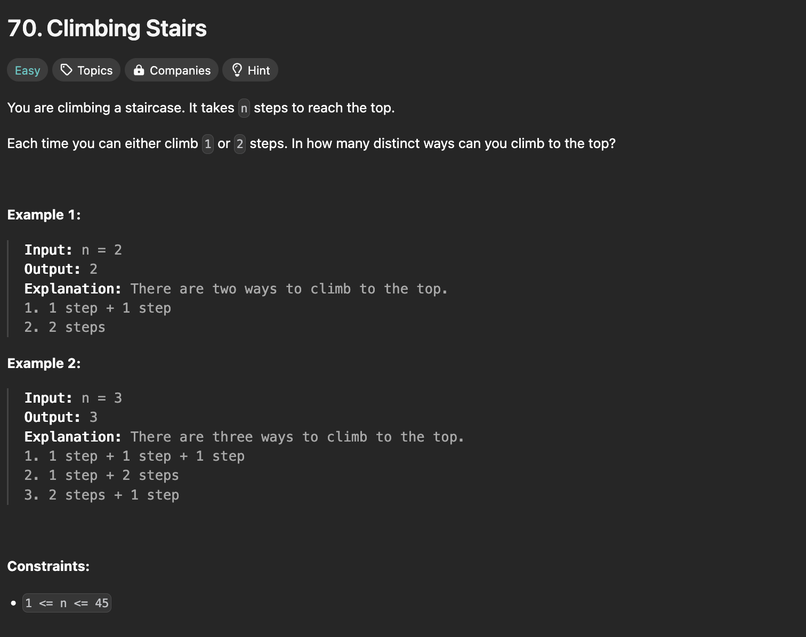

**Miten tein tehtävän:**

**Miten meni:**

**Mitä opin:**

**Mitä voisin tehdä toisin seuraavalla kerralla:**

   ---

8. **Binary Search** ([LeetCode](https://leetcode.com/problems/binary-search/), [Ratkaisu](./easy/binary_search.py))
   
   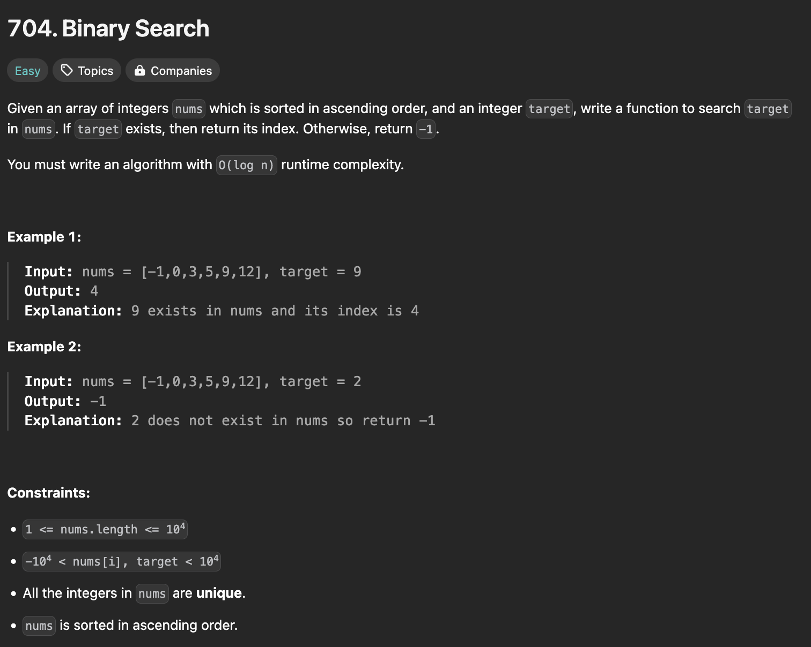

**Miten tein tehtävän:**

**Miten meni:**

**Mitä opin:**

**Mitä voisin tehdä toisin seuraavalla kerralla:**

   ---

9. **Ransom Note** ([LeetCode](https://leetcode.com/problems/ransom-note/), [Ratkaisu](./easy/ransom_note.py))
   
   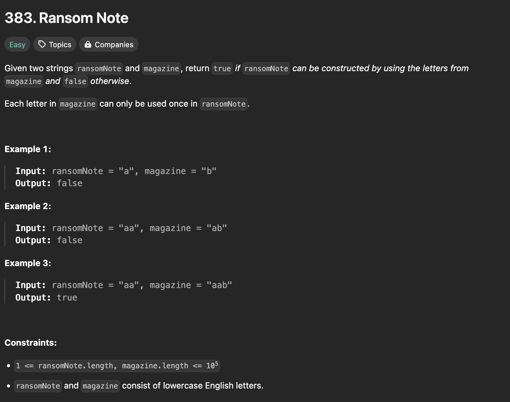

**Miten tein tehtävän:**

**Miten meni:**

**Mitä opin:**

**Mitä voisin tehdä toisin seuraavalla kerralla:**

   ---

10. **Reverse Linked List** ([LeetCode](https://leetcode.com/problems/reverse-linked-list/), [Ratkaisu](./easy/reverse_linked_list.py))
   
   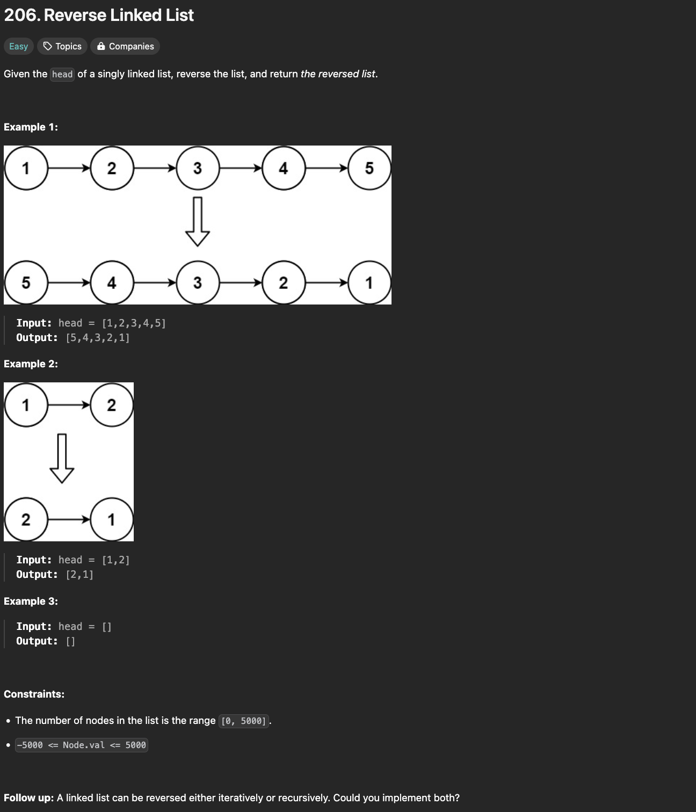


**Miten tein tehtävän:**

**Miten meni:**

**Mitä opin:**

**Mitä voisin tehdä toisin seuraavalla kerralla:**

   ---

11. **First Unique Character in a String** ([LeetCode](https://leetcode.com/problems/first-unique-character-in-a-string/), [Ratkaisu](./easy/first_unique_character_in_a_string.py))
   
   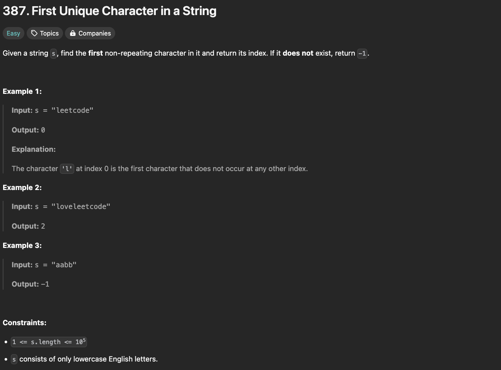


**Miten tein tehtävän:**

**Miten meni:**

**Mitä opin:**

**Mitä voisin tehdä toisin seuraavalla kerralla:**

   ---

12. **Intersection of Two Arrays II** ([LeetCode](https://leetcode.com/problems/intersection-of-two-arrays-ii/), [Ratkaisu](./easy/intersection_of_two_arrays2.py))
   
   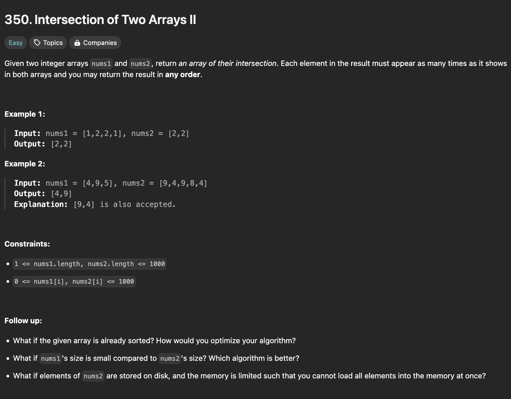

**Miten tein tehtävän:**

**Miten meni:**

**Mitä opin:**

**Mitä voisin tehdä toisin seuraavalla kerralla:**

   ---

13. **Move Zeroes** ([LeetCode](https://leetcode.com/problems/move-zeroes/), [Ratkaisu](./easy/move_zeroes.py))
   
   

**Miten tein tehtävän:**

**Miten meni:**

**Mitä opin:**

**Mitä voisin tehdä toisin seuraavalla kerralla:**

   ---

14. **Contains Duplicate** ([LeetCode](https://leetcode.com/problems/contains-duplicate/), [Ratkaisu](./easy/contains_duplicate.py))
   
   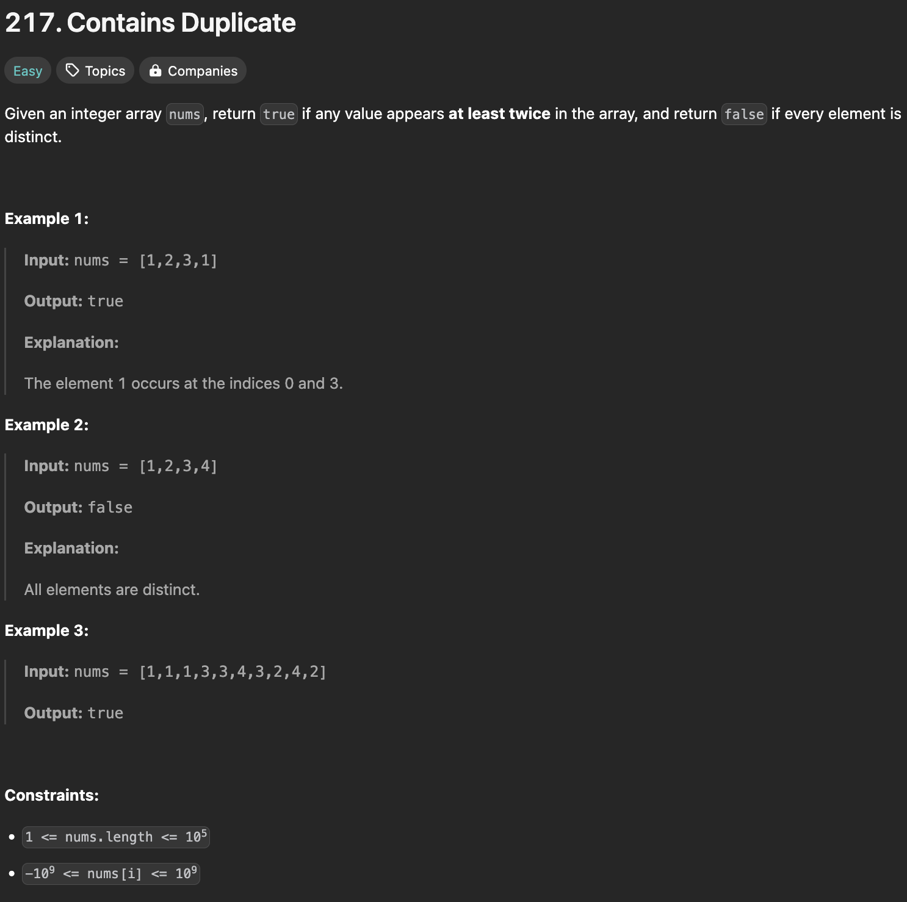

**Miten tein tehtävän:**

**Miten meni:**

**Mitä opin:**

**Mitä voisin tehdä toisin seuraavalla kerralla:**

   ---

15. **Plus One** ([LeetCode](https://leetcode.com/problems/plus-one/), [Ratkaisu](./easy/plus_one.py))
   
   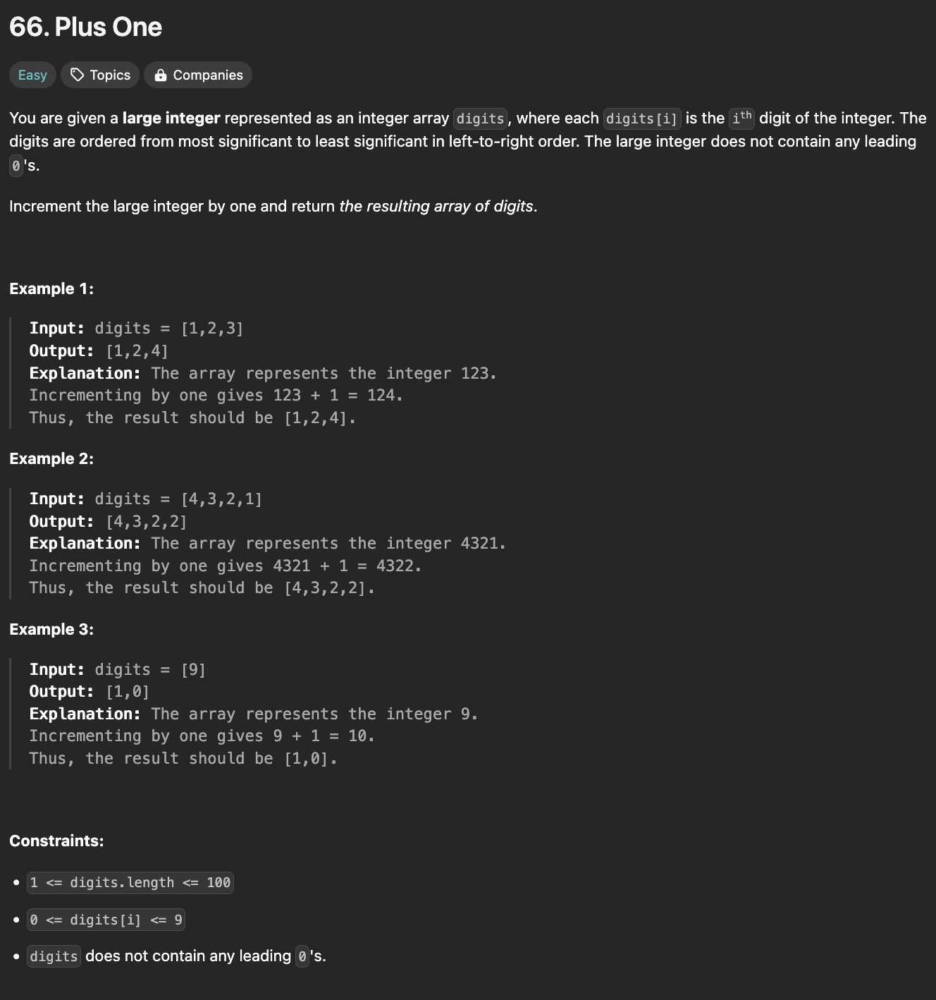

**Miten tein tehtävän:**

**Miten meni:**

**Mitä opin:**

**Mitä voisin tehdä toisin seuraavalla kerralla:**

   ---

### Keskivaikea (4 kpl)

1. **Add Two Numbers** ([LeetCode](https://leetcode.com/problems/add-two-numbers/), [Ratkaisu](./2_medium/add_two_numbers.py))
   
   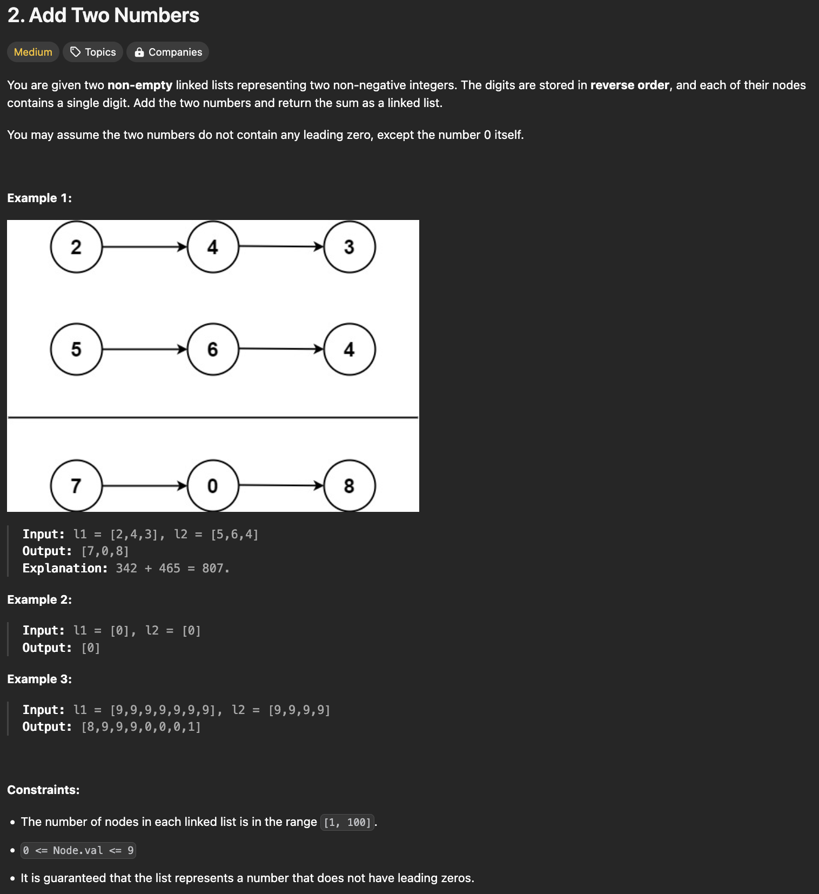

<<<<<<< HEAD
**Miten tein tehtävän:**

**Miten meni:**

**Mitä opin:**

**Mitä voisin tehdä toisin seuraavalla kerralla:**

   ---

2. **Longest Substring Without Repeating Characters** ([LeetCode](https://leetcode.com/problems/longest-substring-without-repeating-characters/), [Ratkaisu](./medium/longest_substring_without_repeating_characters.py))
   
   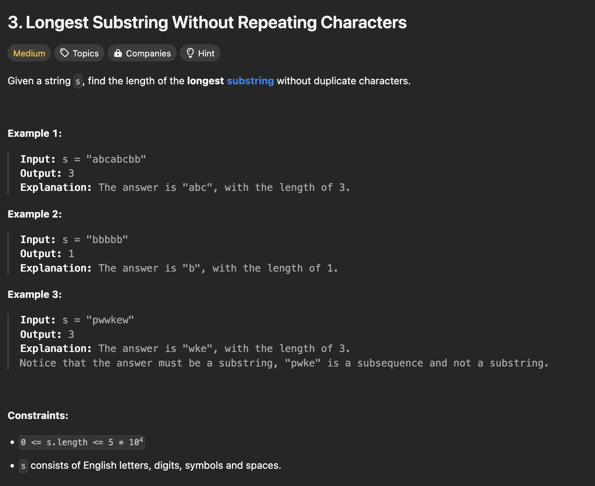

**Miten tein tehtävän:**

**Miten meni:**

**Mitä opin:**

**Mitä voisin tehdä toisin seuraavalla kerralla:**

   ---

3. **Group Anagrams** ([LeetCode](https://leetcode.com/problems/group-anagrams/), [Ratkaisu](./medium/group_anagrams.py))
   
   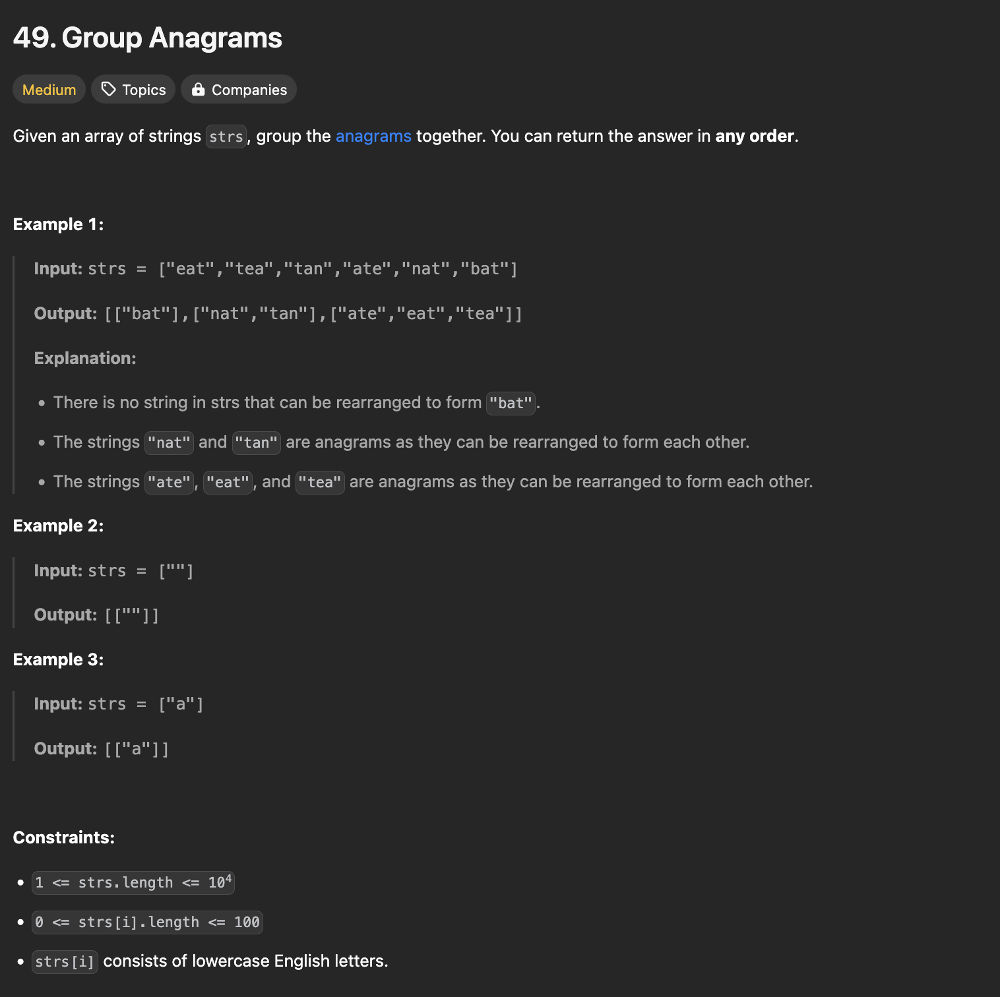

**Miten tein tehtävän:**

**Miten meni:**

**Mitä opin:**

**Mitä voisin tehdä toisin seuraavalla kerralla:**

   ---

4. **Top K Frequent Elements** ([LeetCode](https://leetcode.com/problems/top-k-frequent-elements/), [Ratkaisu](./medium/top_k_frequent-elements.py))
=======
2. **Longest Substring Without Repeating Characters** ([LeetCode](https://leetcode.com/problems/longest-substring-without-repeating-characters/), [Ratkaisu](./2_medium/longest_substring_without_repeating_characters.py))
   
   

3. **Group Anagrams** ([LeetCode](https://leetcode.com/problems/group-anagrams/), [Ratkaisu](./2_medium/group_anagrams.py))
   
   

4. **Top K Frequent Elements** ([LeetCode](https://leetcode.com/problems/top-k-frequent-elements/), [Ratkaisu](./2_medium/top_k_frequent-elements.py))
>>>>>>> 482b47f21b576b635b5b2ebd26b80fd140e8a6cf
   
   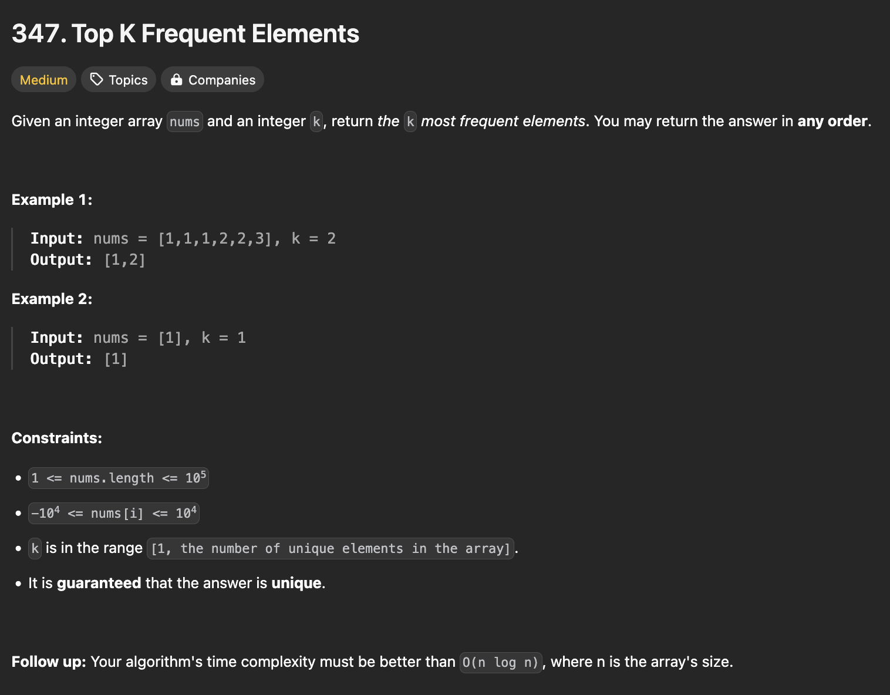

**Miten tein tehtävän:**

**Miten meni:**

**Mitä opin:**

**Mitä voisin tehdä toisin seuraavalla kerralla:**

   ---

### Vaikea (1 kpl)

1. **Median of Two Sorted Arrays** ([LeetCode](https://leetcode.com/problems/median-of-two-sorted-arrays/), [Ratkaisu](./3_hard/median_of_two_sorted_arrays.py))
   
   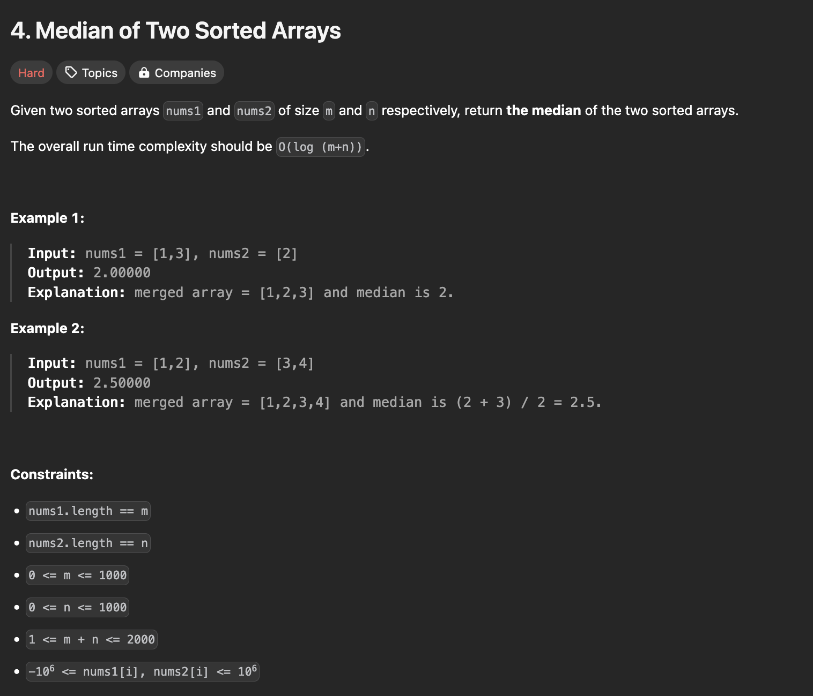

**Miten tein tehtävän:**

**Miten meni:**

**Mitä opin:**

**Mitä voisin tehdä toisin seuraavalla kerralla:**

   ---

## Yhteenveto

!!!Täytä, kun haasteet on tehty!!!

---

> Kaikki tehtävät ja ratkaisut löytyvät tästä GitHub-repositorysta.

