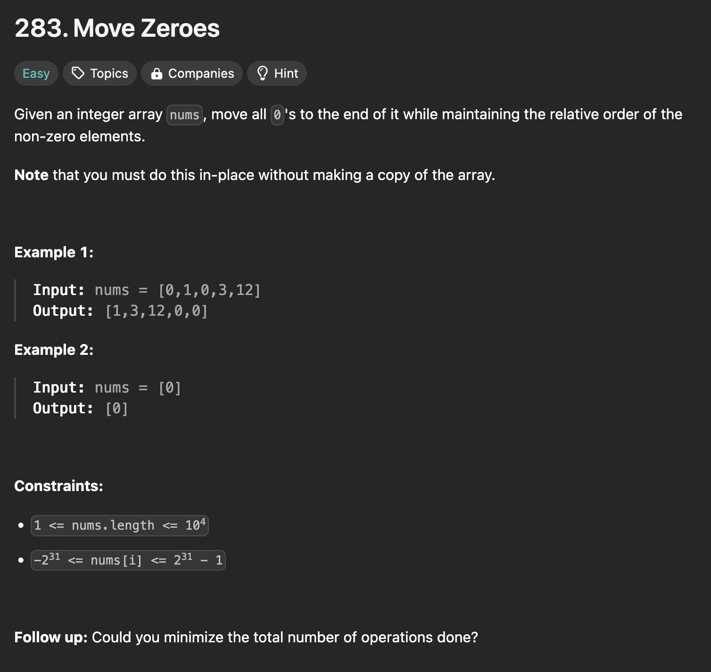
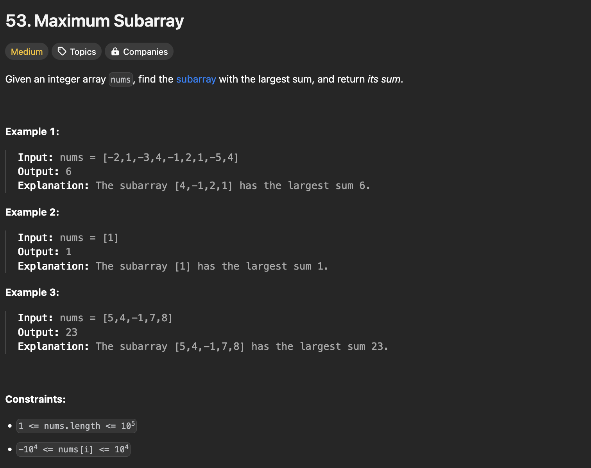

# Seminaarityö: LeetCode with Python

## Johdanto

Tämän seminaarityön ideana on kehittää omaa algoritmista ajattelua ja samalla syventää Python-osaamista käytännön kautta. LeetCode tarjoaa monipuolisia ohjelmointitehtäviä eri aihealueista ja vaikeustasoista ja se on suosittu alusta työnhakuun valmistautuessa tai oman osaamisen testaamisessa.

Tehtävien valinnassa käytin apuna tekoälyä, jonka avulla sain koottua mahdollisimman monipuolisen ja tasapainoisen tehtäväkokonaisuuden. Halusin mukaan erilaisia haasteita, joissa pääsee harjoittelemaan esimerkiksi taulukoita ja merkkijonoja, hakualgoritmeja, tietorakenteita ja dynaamista ohjelmointia. Näin sain rakennettua kokonaisuuden, joka kehittää teknistä osaamista, mutta myös ongelmanratkaisukykyä sekä loogista ajattelua.

Kaikki tehtävät on toteutettu Pythonilla ja pyrin kirjoittamaan ratkaisuni mahdollisimman selkeästi sekä tehokkaasti oman osaamiseni mukaan. Tehtävät on jaettu kolmeen vaikeustasoon: helppoihin, keskivaikeisiin ja vaikeisiin. Jokaiseen tehtävään on lisätty pohdinta tehtävästä: mitä opin sekä mitä haasteita tuli vastaan. Tehtävän yhteydestä löytyy myös kuva alkuperäisestä tehtävänannosta, jotta kokonaisuus olisi mahdollisimman ymmärrettävä.

## Tehtävät

### Helppo (15 kpl)

**1. Two Sum** ([LeetCode](https://leetcode.com/problems/two-sum/), [Ratkaisu](./1_easy/two_sum.py))
   
   

   **Miten tein tehtävän:**
      
   Tein tehtävän brute force -taktiikalla eli kahdella sisäkkäisellä silmukalla. Nämä käyvät läpi kaikki mahdolliset luvut ja etsivät parin, jonka summa on yhtä kuin annettu `target`. Kirjoitin ratkaisun Pythonilla.

   **Miten meni:**

   Ensimmäisellä yrityksellä sain `IndentationError` -virheen. Toisella yrityksellä sain koodin suorittamaan ilman virheitä, mutta se palautti tyhjän listan. Kolmannella yrityksellä vaihdoin hieman lähestymistapaa, mutta sisennys meni taas pieleen. Lopulta sain kuitenkin toimivan ratkaisun. Jo ensimmäisestä tehtävästä tuli olo, että miten voi olla näin vaikeaa, vaikka tämän pitäisi olla tasoltaan helppo. Asiaa auttoi muiden kommenttien lukeminen. Tästä Tajusin, että on tosi yleistä aloittaessa kokea samaa turhautumista ja osaamattomuuden tunnetta. 

   **Mitä opin:**

   - Pythonin sisennys on erittäin tarkkaa – pienikin virhe voi estää koodin ajon kokonaan.

   - On tärkeää lukea virheilmoitukset tarkasti ja etsiä niistä vihjeitä.

   - Vaikka brute force -ratkaisu toimii, ymmärsin, että tehtävän voi ratkaista myös tehokkaammin esimerkiksi HashMapin avulla.

   **Mitä voisin tehdä toisin seuraavalla kerralla:**

   - Suunnitella ratkaisun paremmin ennen koodin kirjoittamista.

   - Käyttää hyväksi materiaaleja sekä dokumentaatioita

   - Idean ymmärrettäessä kokeeilla .

---

**2. Palindrome Number** ([LeetCode](https://leetcode.com/problems/palindrome-number/), [Ratkaisu](./1_easy/palindrome_number.py))
   
   

   **Miten tein tehtävän:**

   Tehtävänä oli tarkistaa, onko annettu kokonaisluku palindromi eli sama etu- ja takaperin luettuna. Muunsin kokonaisluvun merkkijonoksi ja vertasin sitä käännettyyn versioon `x[::-1]`. Jos ne ovat samat, luku on palindromi.

   **Miten meni:**

   Tehtävä oli melko suoraviivainen ja sain sen toimimaan nopeammin kuin `Two Sum` -tehtävän. Jouduin vähän tutkimaan netiste miten Pythonin merkkijonoja voidaan kääntää ja ratkaisu `[::-1]` oli helppo ja tehokas tapa ratkaista tehtävä. 

   **Mitä opin:**

   - Palindromin tarkistaminen onnistuu näppärästi kääntämällä merkkijono `[::-1]` -operaattorilla.

   - Koodia voi usein tiivistää ja tehdä selkeämmäksi poistamalla tarpeettomat ehtorakenteet. Toisaalta joskus tiivein koodi ei ole selkeintä vaikka se olisikin tehokkainta.  

   **Mitä voisin tehdä toisin seuraavalla kerralla:**

   - Tiivistää koodia heti alussa mahdollisimman yksinkertaiseksi, ratkaisussani if-rakenne oli turha ja olisin voinut toteuttaa tehtävän esimerkiksi näin:

   ``` python
   def isPalindrome(self, x: int) -> bool:
    return str(x) == str(x)[::-1]
   ```
---

**3. Merge Two Sorted Lists** ([LeetCode](https://leetcode.com/problems/merge-two-sorted-lists/), [Ratkaisu](./1_easy/merge_two_sorted_lists.py))
   
   

**Miten tein tehtävän:**
Tarkoituksena oli yhdistää kaksi järjestettyä listaa yhdeksi uudeksi järjestetyksi listaksi. Käytin `dummy_node`:a, jonka kautta rakensin uuden listan. Kävin läpi molempia listoja rinnakkain ja lisäsin pienemmän arvon omaavan noden uudelle listalle.

**Miten meni:**

Tehtävä tuntui hieman monimutkaiselta, koska "linked list" -rakenne ei ollut entuudestaan tuttu ja erilainen kuin tavalliset listat. Kävin etsimässä apua tehtävän ratkaisuun ja löysin, että joku oli käyttänyt `dummy_node`:a. Aloin pelleilemään tällä, jonka avulla pääsin vihdoin käyttämään tätä uuden listan tekemiseen. Tehtävä alkoi pikkuhiljaa sujumaan, mutta kyllä sen tekemisessä aika kauan meni.

**Mitä opin:**

- Dummy-noden käyttö on tehokas tapa yksinkertaistaa linkitetyn listan rakentamista.

- Linkitettyjä listoja käsitellessä täytyy olla tarkkana next-osoittimien kanssa, ettei lista vahingossa katkea.

- Harjoittelin myös ehdollista sijoittamista `current_node.next = list1 if list1 else list2` viimeisten solmujen liittämiseen.

**Mitä voisin tehdä toisin seuraavalla kerralla:**

- Luoda piirtämällä itselle visuaalinen kaavio ymmärtämisen helpottamiseksi.

---

**4. Valid Parentheses** ([LeetCode](https://leetcode.com/problems/valid-parentheses/), [Ratkaisu](./1_easy/valid_parentheses.py))
   
   

**Miten tein tehtävän:**

Tehtävänä oli tarkistaa, ovatko annetun merkkijonon sulut oikein sulkeutuneet sekä oikeassa järjestyksessä. Käytin pinoa `stack`, johon lisätään aukeavat sulut ja poistetaan ne, kun vastaava sulkeva sulku löytyy. Lopussa tarkistetaan, että se on tyhjä.

**Miten meni:**

Tehtävä tuntui loogisemmalta kuin aiemmat ja sain sen toimimaan jonkinnäköisesti melko nopeasti, toki ratkaisu ei ollut oikein heti alussa. Jouduin katsomaan vinkkiä, jossa sanottiin, että käytä pinoa. En ollu heti varma miten se toimii, joten menin tutkailemaan sitä netistä. Pinon käytön ymmärtäessäni tehtävän ratkaiseminen meni sujuvasti. Tehtävä ei aiheuttanut sen suurempia ongelmia, mitä pienellä googlaamisella ei pystyisi selvittämään. 

**Mitä opin:**

- Opin mikä on `stack` ja miten sitä voi käyttää rakenteiden käsittelemiseen, kun on kyseessä avausten sekä sulkujen seuraaminen.

**Mitä voisin tehdä toisin seuraavalla kerralla:**

- Harjoitella lisää `stack` -rakenteen käyttöä.

---

**5. Best Time to Buy and Sell Stock** ([LeetCode](https://leetcode.com/problems/best-time-to-buy-and-sell-stock/), [Ratkaisu](./1_easy/best_time_to_buy_and_sell_stock.py))
   
   

**Miten tein tehtävän:**

Tarkoituksena oli löytää suurin mahdollinen voitto ostamalla osake yhtenä päivänä ja myymällä se myöhempänä päivänä. Käytin kahta muuttujaa: `max_profit` seuraamaan suurinta mahdollista voittoa sekä `min_price` seuraamaan halvinta hintaa tähän asti.

**Miten meni:**

Ensin yritin pakottaa `brute force` ratkaisua kahdella silmukalla, mutta lopetin sen nopeasti, sillä halusin löytää ratkaisun, joka toimisi pelkästään yhdellä. Löysin vihdoin miten pystyn päivittämään minimihintaa samalla listaa läpi käymässä, joka tuntui hyvältä. Tosin, matka tyssäsi muutamaan klassiseen `IndentationError` -virheeseen.

**Mitä opin:**

- Opin käyttämään `float('inf')` alkutilan asettamiseen.

**Mitä voisin tehdä toisin seuraavalla kerralla:**

- Miettiä rauhassa ennen ratkaisun yrittämistä.

---

**6. Richest Customer Wealth** ([LeetCode](https://leetcode.com/problems/richest-customer-wealth/), [Ratkaisu](./1_easy/richest_customer_wealth.py))
   
   

**Miten tein tehtävän:**

Tässä tehtävässä laskettiin jokaiselle asiakkaalle hänen kaikkien tiliensä summat ja valittiin niistä suurin. Käytin `sum()` -funktiota yhdistettynä `max()` -funktioon, joka käy kaikki asiakkaat läpi.

**Miten meni:**

Tehtävä oli selkeä ja mukava tehdä. Ratkaisu onnistui kerralla, ja oli kiva huomata, kuinka tehokas yhdistelmä `sum()` ja `max()` oli tähän.

**Mitä opin:**

- Opin lisää `sum()` ja `max()` -funktioiden käyttämisestä

**Mitä voisin tehdä toisin seuraavalla kerralla:**

- Kokeilla vaikka miten voisin saada myös rikkaimman asiakkaan indeksin, enkä pelkästään summan.

---

**7. Climbing Stairs** ([LeetCode](https://leetcode.com/problems/climbing-stairs/), [Ratkaisu](./1_easy/climbing_stairs.py))
   
   

**Miten tein tehtävän:**

Piti selvittää, kuinka monta erilaista tapaa on kiivetä `n` portaan ylös, kun voi ottaa yhden tai kaksi porrasta per askel. Jokainen uusi askelma on edellisten kahden summa. Käytin kahta muuttujaa `first_step` ja `second_step`, joita päivitin silmukassa.

**Miten meni:**

Edellisen tehtävän jälkeen tämä tehtävä oli rentouttavampi, sillä ei tarvinnut opetella kokonaan uusia algoritmejä. Aluksi yritin tehdä rekursiivisen ratkaisun, mutta sen sijaan päädyin dynaamisen ohjelmoinnin ratkaisuun. Tämä ratkaisu toimi yhdellä silmukalla ja oli mukava huomata, että ratkaisu oli myös siisti ja tehokas.

**Mitä opin:**

- Opin käyttämään kahta muuttujaa peräkkäisten arvojen säilyttämiseen.

- Opin ajattelemaan dynaamista ohjelmointia yksinkertaisessa kontekstissa.

**Mitä voisin tehdä toisin seuraavalla kerralla:**

- Piirtää esimerkiksi taulukon n-arvoista ja vastauksista hahmoittaakseni laskennan visuaalisesti.

---

**8. Binary Search** ([LeetCode](https://leetcode.com/problems/binary-search/), [Ratkaisu](./1_easy/binary_search.py))
   
   

**Miten tein tehtävän:**

Tehtävässä piti etsiä tietty luku `target` järjestetystä listasta. Käytin binäärihakua `binary search`, jossa tarkastellaan keskikohtaa ja puolitetaan etsintäaluetta joka kierroksella sen perusteella, onko kohdeluku suurempi vai pienempi.

**Miten meni:**

Tehtävä itsessään oli selkeä, mutta aluksi unohdin päivittää `left` ja `right` arvot oikein, jolloin loin silmukan, joka jäi pyörimään loputtomasti. Mietin mikä on vikana ja pitkän etsimisen jälkeen tajusin käyttää `//` (kokonaislukujako) ja päivittää rajat oikein, jonka jälkeen ratkaisu hyväksyttiin.

**Mitä opin:**

- Opin binäärihaun toiminnan ja miten se perustuu listan puolittamiseen.

- Opin laskemaan keskikohdan oikein: `(left + right) // 2`.

**Mitä voisin tehdä toisin seuraavalla kerralla:**

- Kokeilla vaikka rekursiivista versiota binäärihausta.

---

**9. Ransom Note** ([LeetCode](https://leetcode.com/problems/ransom-note/), [Ratkaisu](./1_easy/ransom_note.py))
   
   

**Miten tein tehtävän:**

Tehtävässä tarkistettiin, voiko `ransomNote` -merkkijonon merkit muodostaa `magazine` -merkkijonosta. Käytin `Counter` -luokkaa, joka laskee merkkien esiintymismäärät molemmissa merkkijonoissa. Tämän jälkeen vertasin, että `magazine` sisältää riittävästi kunkin merkin määrää.

**Miten meni:**

Tehtävä meni yllättävän hyvin. Ratkaisu oli yksinkertainen sekä `Counter` -luokan käyttäminen nopeutti merkkien laskemista. Ei tullut suurempia ongelmia muutakuin yleiset syntax-virheet.

**Mitä opin:**

- Opin käyttämään `Counter` -luokkaa, jonka avulla voidaan laskea merkkien määrät nopeasti.

**Mitä voisin tehdä toisin seuraavalla kerralla:**

- Harjoituksen vuoksi voisin yrittää kehittää ratkaisun käyttämättä `Counter` -luokkaa.

---

**10. Reverse Linked List** ([LeetCode](https://leetcode.com/problems/reverse-linked-list/), [Ratkaisu](./1_easy/reverse_linked_list.py))
   
   


**Miten tein tehtävän:**

Tässä tehtävässä haluttiin kääntää `linked list`. Käytin kolmea apumuuttujaa: `previous_node`, `current_node` ja `next_node`. Kävin listan läpi ja käänsin jokaisen noden next-osoittimen, jolloin lista kääntyi.

**Miten meni:**

Tehtävä oli aluksi hieman haastava, koska linkitetyt listat eivät ole yhtä tuttuja kuin tavalliset listat. Mutta ymmärsin nopeasti, kuinka solmujen linkit käännetään. Ratkaisu onnistui hyvin, eikä tullut suuria ongelmia. 

**Mitä opin:**

- Periaatteet miten linkitetyt listat toimivat.

- Miten kääntää simppeli linkitetty lista yksi node kerrallaan.

**Mitä voisin tehdä toisin seuraavalla kerralla:**

- Seuraavalla kerralla olisin voinut tehdä tämän tehtävän ennen tehtävää "merge two sorted lists". Tämä olisi säästänyt päänsärkyä, sillä koin tämän tehtävän olevan simppelimpi.

---

**11. First Unique Character in a String** ([LeetCode](https://leetcode.com/problems/first-unique-character-in-a-string/), [Ratkaisu](./1_easy/first_unique_character_in_a_string.py))
   
   


**Miten tein tehtävän:**

**Miten meni:**

**Mitä opin:**

**Mitä voisin tehdä toisin seuraavalla kerralla:**

---

**12. Intersection of Two Arrays II** ([LeetCode](https://leetcode.com/problems/intersection-of-two-arrays-ii/), [Ratkaisu](./1_easy/intersection_of_two_arrays2.py))
   
   

**Miten tein tehtävän:**

**Miten meni:**

**Mitä opin:**

**Mitä voisin tehdä toisin seuraavalla kerralla:**

---

**13. Move Zeroes** ([LeetCode](https://leetcode.com/problems/move-zeroes/), [Ratkaisu](./1_easy/move_zeroes.py))
   
   

**Miten tein tehtävän:**

**Miten meni:**

**Mitä opin:**

**Mitä voisin tehdä toisin seuraavalla kerralla:**

---

**14. Contains Duplicate** ([LeetCode](https://leetcode.com/problems/contains-duplicate/), [Ratkaisu](./1_easy/contains_duplicate.py))
   
   

**Miten tein tehtävän:**

**Miten meni:**

**Mitä opin:**

**Mitä voisin tehdä toisin seuraavalla kerralla:**

---

**15. Plus One** ([LeetCode](https://leetcode.com/problems/plus-one/), [Ratkaisu](./1_easy/plus_one.py))
   
   

**Miten tein tehtävän:**

**Miten meni:**

**Mitä opin:**

**Mitä voisin tehdä toisin seuraavalla kerralla:**

---

### Keskivaikea (5 kpl)

**1. Maximum Subarray** ([LeetCode](https://leetcode.com/problems/maximum-subarray/), [Ratkaisu](./medium/maximum_subarray.py))
   
   

**Miten tein tehtävän:**

Tehtävässä piti löytää suurimman summan muodostava peräkkäinen `subarray`. Käytin Kadanen Algoritmia, joka toimii pitämällä kirjaa kahdesta arvosta, tässä tapauksessa: `max_current_sum` ja `max_global_sum`. Jokaisessa vaiheessa tarkastellaan, kannattaako jatkaa nykyistä summaa vai aloittaa uusi.

**Miten meni:**

Rehellisesti en ollut kuullut Kadanen algoritmista ennen, joten jouduin tutkimaan mitä se tekee. Aluksi oli vaikea ymmärtää, miksi vertaillaan `max(nums[i], max_current + nums[i])` Kirjoitin sen käsin paperille, jonka jälkeen se vähän alkoi hahmottua. Koodin sai lopulta toimimaan pitkän vääntämisen jälkeen.

**Mitä opin:**

- Opin miten Kadanen algoritmi toimii käytännössä.

- Ymmärsin, että aina ei tarvitse tallentaa kaikkia alitaulukkoja ja riittää vain parhaan tallentaminen

**Mitä voisin tehdä toisin seuraavalla kerralla:**

- Tutustua lisää jatkuvaan päivitykseen liittyviä algoritmeja. 

---

**2. Longest Substring Without Repeating Characters** ([LeetCode](https://leetcode.com/problems/longest-substring-without-repeating-characters/), [Ratkaisu](./2_medium/longest_substring_without_repeating_characters.py))
   
   

**Miten tein tehtävän:**

**Miten meni:**

**Mitä opin:**

**Mitä voisin tehdä toisin seuraavalla kerralla:**

---

**3. Group Anagrams** ([LeetCode](https://leetcode.com/problems/group-anagrams/), [Ratkaisu](./2_medium/group_anagrams.py))
   
   

**Miten tein tehtävän:**

**Miten meni:**

**Mitä opin:**

**Mitä voisin tehdä toisin seuraavalla kerralla:**

---

**4. Top K Frequent Elements** ([LeetCode](https://leetcode.com/problems/top-k-frequent-elements/), [Ratkaisu](./2_medium/top_k_frequent-elements.py))
   

**Miten tein tehtävän:**

**Miten meni:**

**Mitä opin:**

**Mitä voisin tehdä toisin seuraavalla kerralla:**

---

**5. Add Two Numbers** ([LeetCode](https://leetcode.com/problems/add-two-numbers/), [Ratkaisu](./2_medium/add_two_numbers.py))
   
    

**Miten tein tehtävän:**

**Miten meni:**

**Mitä opin:**

**Mitä voisin tehdä toisin seuraavalla kerralla:**

---

### Vaikea (1 kpl)

**1. Median of Two Sorted Arrays** ([LeetCode](https://leetcode.com/problems/median-of-two-sorted-arrays/), [Ratkaisu](./3_hard/median_of_two_sorted_arrays.py))
   
   

**Miten tein tehtävän:**

**Miten meni:**

**Mitä opin:**

**Mitä voisin tehdä toisin seuraavalla kerralla:**

---

## Yhteenveto

!!!Täytä, kun haasteet on tehty!!!

---

> Kaikki tehtävät ja ratkaisut löytyvät tästä GitHub-repositorysta.

